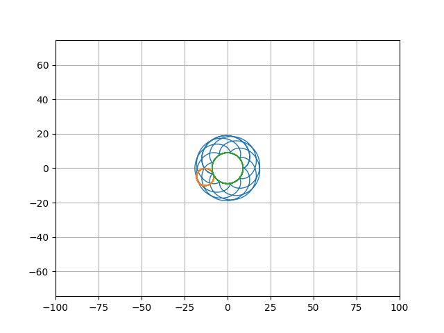
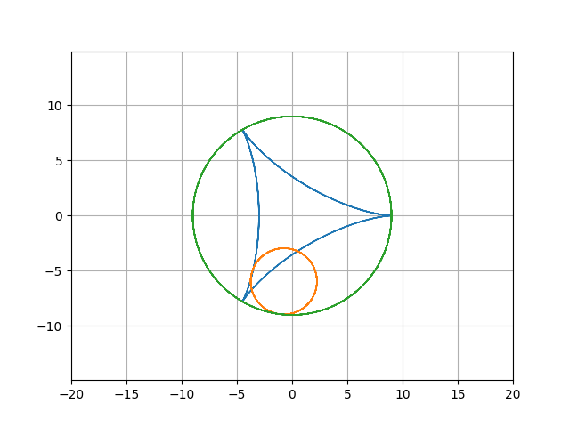
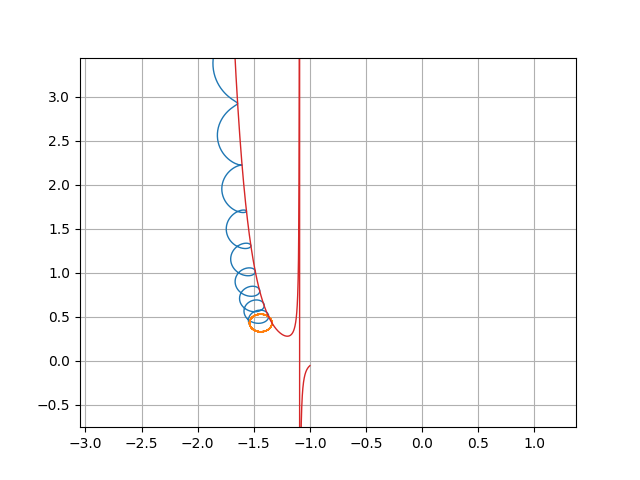

# Animated-Cycloids

## Description
This Python script visualizes different types of cycloidal paths using matplotlib's animation capabilities. Users can choose from four different animations: cycloid, epicycloid, hypocycloid, and a custom path. Each animation provides a visual representation of the path described by a point on the circumference of a circle rolling along a straight line or another circle.

## Animation Descriptions

- Cycloid: Generated by a point on the rim of a circle rolling along a straight line.
- Epicycloid: Formed by a point on the circumference of a circle rolling around the outside of another circle.
- Hypocycloid: Created by a point on the circumference of a circle rolling inside another circle.
- Custom Path: A unique path based on a function (y = 14xe^(-8x))/10^6*(4x+13exp(x))), visualizing a more complex trajectory.

## Customizing the Script

The parameters at the beginning of the script such as R, r, rotations, precision, and boundary can be adjusted to modify the size, speed, and detail of the animations.

## Example cycloids
Epicycloid

Hypocycloid

A circle rolling on y = 14xe^(-8x))/10^6*(4x+13exp(x))

